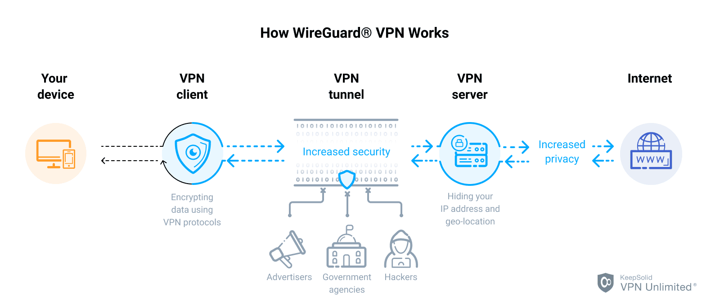

# ติดตั้ง LNbits และทำ Clearnet บน VPS (ด้วย Wireguard)

สืบเนื่องจากผมจำเป็นต้องย้าย VPS จาก lunanode ไปที่ Digital Ocean เพื่อให้ connectivity และ ping time ดีขึ้น อีกทั้งผมมีเหตุจำเป็นต้องเปลี่ยน VPN Software จาก OpenVPN ไปเป็น Wireguard เพราะมีอุปกรณ์อื่น ๆ ที่จะใช้งานร่วมด้วย (มันรองรับเฉพาะ Wireguard) นั้นจึงเป็นเหตุให้ต้องทำ VPS ใหม่ทั้งหมด จึงถือเป็นโอกาสอันดีที่จะเปลี่ยนไปใช้ Wireguard

ขั้นตอนต่างๆ ในการติดตั้งยังคงอ้างอิงจาก [TrezorHannes/vps-lnbits](https://github.com/TrezorHannes/vps-lnbits) แต่มีการปรับค่าพารามิเตอร์อีกทั้งเปลี่ยนจาก OpenVPN ไปเป็น Wireguard ผมจะขอจัดกลุ่มขั้นตอนการติดตั้งใหม่ดังนี้

- [เตรียมความพร้อม](#เตรียมความพร้อม)
  - [VPS: ติดตั้ง VPS บน Cloud](#vps-ติดตั้ง-vps-บน-cloud)
  - [VPS: hardening VPS ให้เหมาะสม](#vps-hardening-vps-ให้เหมาะสม)
- [ติดตั้งและ config Wireguard บน VPS และ node](#ติดตั้งและ-config-wireguard-บน-vps-และ-node)
  - [VPS: ติดตั้ง Wireguard บน VPS พร้อม config key](#vps-ติดตั้ง-wireguard-บน-vps-พร้อม-config-key)
  - [Node: ติดตั้งและทดสอบ VPN Tunnel บน node](#node-ติดตั้งและทดสอบ-vpn-tunnel-บน-node)
  - [VPS: ทำ port forward บน VPS](#vps-ทำ-port-forward-บน-vps)
- [แก้ไขพารามิเตอร์บน LND สำหรับรองรับ hybrid mode และ LNbits](#แก้ไขพารามิเตอร์บน-lnd-สำหรับรองรับ-hybrid-mode-และ-lnbits)
  - [Node: แก้ไขพารามิเตอร์บน LND](#node-แก้ไขพารามิเตอร์บน-lnd)
  - [Node: Restart LND](#node-restart-lnd)
- [ติดตั้ง LNbits บน VPS](#ติดตั้ง-lnbits-บน-vps)
  - [Node: การคัดลอกสิทธิ์ LNbits เพื่อใช้เชื่อมต่อกับ LND](#node-การคัดลอกสิทธิ์-lnbits-เพื่อใช้เชื่อมต่อกับ-lnd)
  - [VPS: ติดตั้ง LNbits บน VPS](#vps-ติดตั้ง-lnbits-บน-vps)
  - [VPS: ทำ Domain, Webserver และ SSL Certificate](#vps-ทำ-domain-webserver-และ-ssl-certificate)

## เตรียมความพร้อม
ในขั้นตอนแรก เราต้องเตรียมความพร้อมเครื่อง Laptop/Desktop ให้พร้อม โดยจำเป็นต้องดาวน์โหลด putty, pscp และ puttygen ที่ https://www.putty.org จากนั้นให้สร้าง key จาก puttygen สำหรับ Laptop และสร้าง key สำหรับ node ด้วยคำสั่ง ssh-keygen -t ed25519 

หลังจากนั้น เราจำเป็นต้องสมัคร VPS บน Cloud ซึ่งมีให้เลือกหลากหลายโดยที่ผมใช้คือ Digital Ocean หรือถ้าใครต้องการที่อื่นๆ ก็สามารถใช้ได้เช่น Digital Ocean, Amazon Web Server เป็นต้น

### VPS: ติดตั้ง VPS บน Cloud
เมื่อสมัคร cloud เรียบร้อยให้ทำการสร้าง VPS ขึ้นมาใหม่ โดยเลือก OS เป็น Ubuntu และจำเป็นต้องใช้ Public IP ให้จด Public IP ที่ใช้บน VPS ไว้เพราะ IP นี้จำเป็นต้องสำหรับการเชื่อมต่อของ LND และ LNbits 
สำหรับ VPS ที่สร้างใหม่ ควรใช้ authentication ด้วย SSH key ซึ่งเราได้ generate มาก่อนในขั้นตอนก่อนหน้าแล้ว

### VPS: hardening VPS ให้เหมาะสม
ทำการอัพเกรด OS และ Config UFW
~~~
sudo apt-get update
sudo apt-get upgrade
sudo apt-get install docker.io tmux
sudo systemctl start docker.service
sudo apt install ufw
sudo ufw default deny incoming
sudo ufw default allow outgoing
sudo ufw allow OpenSSH
sudo ufw allow 80 comment 'Standard Webserver'
sudo ufw allow 443 comment 'SSL Webserver'
sudo ufw allow 9735 comment 'LND Main Node 1'
sudo ufw allow 41194/udp comment 'Wireguard'
sudo ufw enable
sudo apt install fail2ban
sudo timedatectl set-timezone Asia/Bangkok
~~~

## ติดตั้งและ config Wireguard บน VPS และ node
ขั้นตอนนี้เป็นการสร้าง tunnel ระหว่าง VPS และ node ให้สามารถเชื่อมต่อกันได้แบบปลอดภัย

### VPS: ติดตั้ง Wireguard บน VPS พร้อม config key
ติดตั้ง Wireguard บน VPS ที่สร้างขึ้น
~~~
sudo apt install wireguard
~~~
เมื่อติดตั้ง Wireguard เสร็จแล้ว ให้สร้าง Private Key & Public Key
~~~
sudo -i
mkdir -m 0700 /etc/wireguard/
cd /etc/wireguard/
umask 077; wg genkey | tee privatekey | wg pubkey > publickey

# แสดง private key และ public key
ls -l privatekey publickey
cat privatekey
# จด private key --> <SERVER_PRIVATE_KEY>
cat publickey
# จด public key --> <SERVER_PUBLIC_KEY>
~~~
แก้ไขไฟล์ `/etc/wireguard/wg0.conf`
~~~
sudo nano /etc/wireguard/wg0.conf
~~~
เพิ่ม Private Key ไปที่ท้ายไฟล์ดังนี้
~~~
## Set Up WireGuard VPN on Ubuntu By Editing/Creating wg0.conf File ##
[Interface]
## My VPN server private IP address ##
Address = 192.168.6.1/24
 
## My VPN server port ##
ListenPort = 41194
 
## VPN server's private key i.e. /etc/wireguard/privatekey ##
PrivateKey = <SERVER_PRIVATE_KEY>
~~~
Enable และ Start Wireguard
~~~
sudo systemctl enable wg-quick@wg0
sudo systemctl start wg-quick@wg0
sudo systemctl status wg-quick@wg0
~~~
เช็ค interface wg0
~~~
sudo wg
sudo ip a show wg0
~~~

### Node: ติดตั้งและทดสอบ VPN Tunnel บน node
ติดตั้ง Wireguard และสร้างไฟล์ config บน node
~~~
sudo apt install wireguard
sudo sh -c 'umask 077; touch /etc/wireguard/wg0.conf'
sudo -i
cd /etc/wireguard/
sudo umask 077; wg genkey | tee privatekey | wg pubkey > publickey
ls -l publickey privatekey
## Note down the privatekey ##
cat privatekey
# จด private key --> <CLIENT_PRIVATE_KEY>
cat publickey
# จด public key --> <CLIENT_PUBLIC_KEY>

ip route list table main default
# จด Gateway IP --> <GATEWAY_IP>
ip -brief address show eth0
# จด VPS Local IP --> <VPS_LOCAL_IP>
resolvectl dns eth0
# จด DNS Server 1 & 2 --> <DNS_IP_1> <DNS_IP_1>
~~~
แก้ไขไฟล์ `/etc/wireguard/wg0.conf` บน node
~~~
nano /etc/wireguard/wg0.conf
~~~
เพิ่มดังนี้
~~~
[Interface]
## This Desktop/client's private key ##
PrivateKey = <CLIENT_PRIVATE_KEY>
 
## Client ip address ##
Address = 192.168.6.2/24

PostUp = ip rule add table 200 from <VPS_LOCAL_IP>
PostUp = ip route add table 200 default via <GATEWAY_IP>
PreDown = ip rule delete table 200 from <VPS_LOCAL_IP>
PreDown = ip route delete table 200 default via <GATEWAY_IP>

DNS = <DNS_IP_1> <DNS_IP_1>
[Peer]
## Ubuntu 20.04 server public key ##
PublicKey = <SERVER_PUBLIC_KEY>
 
## set ACL ##
AllowedIPs = 192.168.6.0/24
 
## Your VPS server's public IPv4/IPv6 address and port ##
Endpoint = <PUBLIC_IP>:41194
 
##  Key connection alive ##
PersistentKeepalive = 15
~~~
Enable และ Start Wireguard บน node
~~~
sudo systemctl enable wg-quick@wg0
sudo systemctl start wg-quick@wg0
sudo systemctl status wg-quick@wg0
~~~

### VPS: เพิ่ม client และทำ port forward บน VPS
หยุดการทำงาน Wireguard และแก้ไขไฟล์ config
~~~
sudo systemctl stop wg-quick@wg0
sudo vi /etc/wireguard/wg0.conf
~~~
เพิ่มดังนี้
~~~
[Peer]
## Desktop/client VPN public key ##
PublicKey = <CLIENT_PUBLIC_KEY>
 
## client VPN IP address (note  the /32 subnet) ##
AllowedIPs = 192.168.6.2/32
~~~
แก้ไขไฟล์แล้วสั่ง Start Wireguard
~~~
sudo systemctl start wg-quick@wg0
~~~
หลังจาก VPS และ node ของเรา connect ผ่าน Wireguard สำเร็จ node และ VPS จะคุยกันได้ภายใน tunnel และจะมี Private IP ภายใน tunnel ดังนี้
~~~
VPS IP  : 192.168.6.1
Node IP : 192.168.6.2
~~~

~~~
iptables -A PREROUTING -t nat -i eth0 -p tcp -m tcp --dport 9735 -j DNAT --to 192.168.6.2:9735
iptables -t nat -A POSTROUTING -d 192.168.6.0/24 -o wg0 -j MASQUERADE

mkdir /etc/wireguard/helper
nano /etc/wireguard/helper/add-nat-routing.sh
# Add the following line to the file
iptables -A PREROUTING -t nat -i eth0 -p tcp -m tcp --dport 9735 -j DNAT --to 192.168.6.2:9735
iptables -t nat -A POSTROUTING -d 192.168.6.0/24 -o wg0 -j MASQUERADE
~~~
แก้ไขไฟล์ `/etc/wireguard/wg0.conf` โดนเพิ่มดังนี้
~~~
chmod u+x /etc/wireguard/helper/*.sh
nano /etc/wireguard/wg0.conf
# Add following line
PostUp = /etc/wireguard/helper/add-nat-routing.sh

sudo vi /etc/sysctl.d/10-wireguard.conf
# Add following line
net.ipv4.ip_forward=1
net.ipv6.conf.all.forwarding=1

sudo sysctl -p /etc/sysctl.d/10-wireguard.conf
sudo chmod -v +x /etc/wireguard/helper/*.sh
sudo systemctl restart wg-quick@wg0.service
~~~

## แก้ไขพารามิเตอร์บน LND สำหรับรองรับ hybrid mode และ LNbits
เพื่อให้ LND เราสามารถใช้ Hybrid Mode และ LNbits จำเป็นต้องแก้ไขไฟล์ lnd.conf และ restart lnd

### Node: แก้ไขพารามิเตอร์บน LND
เปิดพอร์ตบน firewall
~~~
sudo ufw allow 9735 comment 'allow LND from outside'
sudo ufw allow 8080 comment 'allow RestLNDWallet from outside'
~~~
เปิดไฟล์ lnd.con เพื่อแก้ไข
* Raspibolt
~~~
cd /data/lnd
sudo nano lnd.conf
~~~
* Citadel
~~~
cd ~/citadel/lnd
sudo nano lnd.conf
# and
sudo nano ~/citadel/templates/lnd-sample.conf
~~~
แก้ไขพารามิเตอร์ใน lnd.conf (ให้เพิ่ม tlsextraip เข้าไปใน lnd.conf ไม่ลบของเดิมที่มีอยู่)
~~~
[Application Options]
allow-circular-route=1
externalip=<PUBLIC_IP>:9735
listen=0.0.0.0:9735
restlisten=0.0.0.0:8080
tlsextraip=192.168.6.2
nat=false

[tor]
tor.active=true
tor.v3=true
tor.streamisolation=false
tor.skip-proxy-for-clearnet-targets=true
~~~
การเพิ่ม tlsextraip ใน lnd.conf เพื่อเพิ่ม IP เข้าใน cert file เราจึงจำเป็นต้องลบ cert และ key เดิมเสียก่อน แล้วไฟล์ทั้งสองจะถูกสร้างใหม่หลังจาก restart lnd
~~~
mv tls.cert tls.cert.old
mv tls.key tls.key.old
~~~

### Node: Restart LND
ทำการ restart lnd ด้วยคำสั่งดังนี้
* Raspibolt
~~~
sudo systemctl restart lnd.service
~~~
* Citadel
~~~
sudo docker restart lightning
~~~
หลังจาก restart lnd เรียบร้อยแล้ว URI จะปรากฎ 2 ค่า (หนึ่งในนั้นเป็น IP Address) และ cert file (tls.cert & tls.key) จะถูกสร้างขึ้นใหม่เพื่อรองรับการเชื่อมต่อจาก VPS

## ติดตั้ง LNbits บน VPS
ขั้นตอนนี้เป็นส่วนของการติดตั้ง LNbits บน VPS เพื่อให้สามารถใช้งานได้จากภายนอกบ้าน (node เรารันในบ้าน) ทำให้สามารถใช้จ่าย bitcoin นอกสถานที่แต่ยังคงจ่ายผ่าน node ของเราเองที่รันอยู่ภายในบ้านได้

### Node: การคัดลอกสิทธิ์ LNbits เพื่อใช้เชื่อมต่อกับ LND
คัดลอก tls.cert และ macaroon จาก LN Node ของเราไปเก็บไว้บน VPS ซึ่งจำเป็นต้องแก้ <USER> และ <PUBLIC_IP> ตามระบบที่เราใช้
* Raspibolt
~~~
scp /data/lnd/tls.cert <VPS_USER>@<PUBLIC_IP>:~
scp /data/lnd/data/chain/bitcoin/mainnet/admin.macaroon <VPS_USER>@<PUBLIC_IP>:~
~~~
* Citadel
~~~
scp ~/citadel/lnd/tls.cert <VPS_USER>@<PUBLIC_IP>:~
scp ~/citadel/lnd/data/chain/bitcoin/mainnet/admin.macaroon <VPS_USER>@<PUBLIC_IP>:~
~~~
  
### VPS: ติดตั้ง LNbits บน VPS
ก่อนเริ่มติดตั้ง เราสามารถเช็ค cert ที่คัดลอกมาจาก node โดยใชคำสั่ง ซึ่งถ้าไม่ถูกต้องอาจลองตรวจสอบไฟล์ที่คัดลอกมาอีกครั้ง
~~~
curl https://192.168.6.2:8080 -v --cacert ~/tls.cert
~~~
ถ้า cert ที่คัดลอกมาจาก node ไม่สามารถใช้ได้ อาจจะต้องใส่ชื่อใน /etc/hosts ให้ตรงกับ url ของ cert จึงจะใช้ได้ เช่น node ของเราชื่อ <NODE_HOSTNAME> เราจำเป็นต้องเพิ่มในไฟล์ /etc/hosts ดังนี้
  
~~~
192.168.6.2    <NODE_HOSTNAME>
~~~
ถ้าตรวจสอบ cert ผ่านเรียบร้อย เราสามารถเริ่มติดตั้ง LNbits ได้ดังนี้

~~~
sudo apt-get install git
git clone https://github.com/lnbits/lnbits-legend
sudo apt update
sudo apt install python3-venv
cd lnbits-legend
python3 -m venv venv
./venv/bin/pip install -r requirements.txt
mkdir ~/lnbits-legend/data
cp .env.example .env
sudo nano .env
~~~
แก้ไขไฟล์ .env ดังนี้ (ต้องแก้ <USER_HOME> ตามที่ใช้)
~~~
LNBITS_DATA_FOLDER="<USER_HOME>/lnbits-legend/data"
LNBITS_BACKEND_WALLET_CLASS=LndRestWallet
LND_REST_ENDPOINT="https://192.168.6.2:8080"
LND_REST_CERT="<USER_HOME>/tls.cert"
LND_REST_MACAROON="<USER_HOME>/admin.macaroon"
~~~
ทำการ build static file และเริ่มทดสอบ start 
~~~
./venv/bin/python build.py
tmux new -s lnbits
./venv/bin/uvicorn lnbits.__main__:app --port 5000 --host 0.0.0.0
~~~

หลังจากติดตั้งเสร็จแล้ว เราจำเป็นต้องทำ lnbits services เพื่อให้ start ทุกครั้งที่ reboot เครื่อง

~~~
sudo nano /etc/systemd/system/lnbits.service
~~~
ใส่รายละเอียดดังนี้ (จำเป็นต้องแก้ <USER> และ <USER_HOME> ให้ถูกต้อง ถ้าใช้ lunanode จะเป็น USER=ubuntu, USER_HOME=/home/ubuntu)
~~~
# Systemd unit for lnbits
# /etc/systemd/system/lnbits.service

[Unit]
Description=LNbits

[Service]
WorkingDirectory=<USER_HOME>/lnbits-legend
ExecStart=<USER_HOME>/lnbits-legend/venv/bin/uvicorn lnbits.__main__:app --port 5000 --host 0.0.0.0
User=<USER>
Restart=always
TimeoutSec=120
RestartSec=30
Environment=PYTHONUNBUFFERED=1

[Install]
WantedBy=multi-user.target
~~~

หลังจากได้ไฟล์ lnbits.service แล้ว เราต้อง enable และ start ขึ้นมาดังนี้
~~~
sudo systemctl enable lnbits.service
sudo systemctl start lnbits.service
~~~

### VPS: ทำ Domain, Webserver และ SSL Certificate

#### Domain
เราจำเป็นต้อง register domain ของเราเองขึ้นมา ซึ่งเราสามารถใช้ free domain จาก duckdns.org ได้ดังนี้
 - เข้าไปที่เว็บ https://duckdns.org
 - login ด้วย gmail หรือ github หรืออะไรก็แล้วแต่เราได้เลย
 - หลังจากนั้นให้สร้าง domain ของเราขึ้นมา โดยใส่ ip เป็น Public IP ของ VPS
 - จด token ในหน้า duckdns.org ของเราไว้และเก็บเป็นความลับ เพราะ token เปรียบเสมือน private key เพื่อแสดงความเป็นเจ้าของ domain
 
#### SSL Certificate
ใช้คำสั่งเพื่อ generate SSL Certificate สำหรับใช้งานกับ LNbits บน domain ของเราเอง 
~~~
sudo apt update
sudo apt install nginx certbot
sudo systemctl stop nginx
sudo certbot certonly --standalone --preferred-challenges http-01 -d <DOMAIN>.duckdns.org

~~~
 - certbot จาก generate certificate สำหรับ domain ที่เราสร้างขึ้นอยู่ใน `/etc/letsencrypt/live/<DOMAIN>.duckdns.org/fullchain.pem` และ `/etc/letsencrypt/live/<DOMAIN>.duckdns.org/privkey.pem`

#### Webserver NGINX
สร้างไฟล์ config สำหรับ LNbits ใน nginx
~~~
sudo nano /etc/nginx/sites-available/lnbits.conf
~~~
ใส่ตามนี้
~~~
server {
# Binds the TCP port 80
listen 80;
# Defines the domain or subdomain name
server_name <DOMAIN>.duckdns.org;
# Redirect the traffic to the corresponding
# HTTPS server block with status code 301
return 301 https://$host$request_uri;
}
server {
listen 443 ssl; # tell nginx to listen on port 443 for SSL connections
server_name <DOMAIN>.duckdns.org; # tell nginx the expected domain for requests
access_log /var/log/nginx/lnbits-access.log; # Your first go-to for troubleshooting
error_log /var/log/nginx/lnbits-error.log; # Same as above
location / {
proxy_pass http://127.0.0.1:5000; # This is your uvicorn LNbits local host IP and port
proxy_set_header Upgrade $http_upgrade;
proxy_set_header Connection 'upgrade';
proxy_set_header X-Forwarded-Proto https;
proxy_set_header Host $host;
proxy_http_version 1.1; # headers to ensure replies are coming back and forth through your domain
}
ssl_certificate /etc/letsencrypt/live/<DOMAIN>.duckdns.org/fullchain.pem; # Point to the fullchain.pem from Certbot
ssl_certificate_key /etc/letsencrypt/live/<DOMAIN>.duckdns.org/privkey.pem; # Point to the private key from Certbot
}
~~~
ใช้คำสั่งเพื่อตรวจสอบความถูกต้องและเริ่ม start ใช้งานได้เลย
~~~
sudo nginx -t
sudo ln -s /etc/nginx/sites-available/lnbits.conf /etc/nginx/sites-enabled/
sudo systemctl start nginx
~~~

เสร็จสิ้นทุกขั้นตอน เราจะสามารถเข้าหน้าเว็บของ LNbits ด้วย `https://<DOMAIN>.duckdns.org` ซึ่งเชื่อมต่อกับ node ของเราผ่าน tunnel ที่เป็นส่วนตัวและปลอดภัย ได้จากภายนอกบ้าน ทุกที่ทั่วโลกครับ
